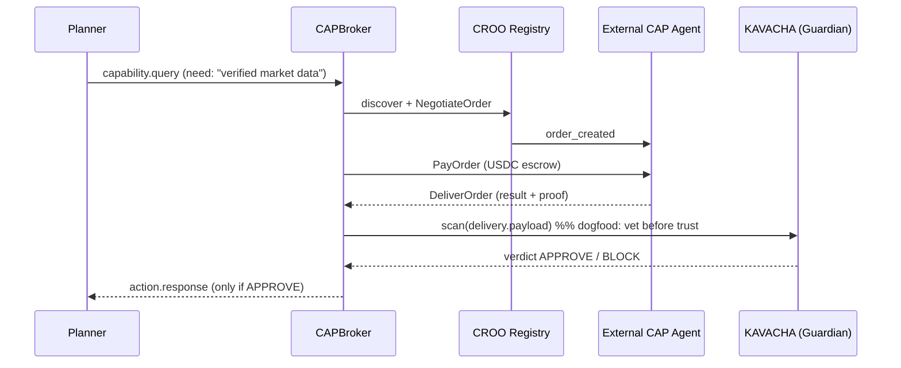

# BUILD PROMPT — ERAYA × CAP (CROO Agent Commerce)

**Codename:** ERAYA-COMMERCE (the `croo` branch)
**Hackathon:** CROO Agent Hackathon (DoraHacks)
**Base repo:** `github.com/martian3062/eraya_microsoft` (extend the `caspr` branch)
**Thesis in one line:** *ERAYA's Guardian (KAVACHA) becomes a paid, CAP-callable trust service on CROO — and ERAYA's swarm becomes a CAP buyer that vets every external delivery through its own KAVACHA before acting. Bidirectional A2A commerce in one agent.*
**Tracks (max 2):** Data & Verification Agents *(primary)* · Developer Tooling Agents *(secondary)*
**Reuse target:** ~85% — the scan, grade, HMAC receipt, A2A bus, discovery, and quorum all exist. New code is one CAP gateway app.

> **Instruction to the coding agent:** This spec extends an existing Django 5.2 + DRF + Channels codebase (structure in §4). Do **not** rebuild KAVACHA — it already exists as `apps/security/` + `core/agents/guardian.py`. Do **not** route CAP settlement through the existing x402 bus — CAP settles natively on Base/USDC (§2.3). Follow ERAYA's **graceful-fallback facade** principle: if `CROO_SDK_KEY` is unset, the CAP gateway runs in deterministic demo mode and the swarm keeps running. Match the repo's existing style (Pydantic schemas, OTel spans, HMAC audit, mermaid diagrams).

---

## 0. WHY THIS IS THE STRONGEST CROO ENTRY

CROO judges **A2A composability** — agents hiring agents. Most entries are leaf-node apps. ERAYA is a swarm that is *already built around* agents hiring agents (A2A bus, capability discovery, x402-paid quorum). Bolting CAP on makes it the only submission that demonstrates commerce in **both directions**:

| Direction | What it proves | Reuses |
|---|---|---|
| **SELL** — external agent hires ERAYA's `KAVACHA Scan` / `PANJSHIR Grade` | ERAYA is a priced, discoverable dependency other agents call | `apps/security/` attack-sim + critic-review |
| **BUY** — ERAYA's Planner hires an external CAP agent as a swarm dependency | ERAYA composes external paid capabilities into its own plans | `bus.find_agents()` + swarm quorum + Guardian approval |
| **DOGFOOD** — inbound CAP deliveries are scanned by KAVACHA before the swarm trusts them | The exact "vet another agent's output before acting" thesis, realized internally | `attack-sim` pipeline on the buy path |

**The free win:** CAP's `DeliverOrder` demands *{result hash, execution log, attestation}* before it will settle. ERAYA's `AuditSigner` already emits exactly that on every Guardian decision (HMAC-SHA256 over the record, plus the `timeline[]` and `audit_id`). The proof CAP asks providers to build is already in `guardian.py`. This is the headline technical talking point.

---

## 1. WHAT ALREADY EXISTS (do not rebuild — route to it)

| CAP need | Existing ERAYA surface | File |
|---|---|---|
| Injection + policy scan → verdict | `POST /api/v1/security/attack-sim/` → `InjectionSentinel.scan()` → `PolicyAuditor.audit()` (R001–R003 + OPA) → verdict/score/rule/timeline | `apps/security/` + `core/agents/guardian.py` |
| Quality grade (LLM-as-judge) | `POST /api/v1/security/critic-review/` | `core/casper/` critic path |
| Signed delivery proof | `AuditSigner.sign()` HMAC-SHA256 + `AuditLog` + `audit_id` | `core/agents/guardian.py` |
| A2A identity + discovery | `A2ABus.find_agents(capability, domain, trust_tier)`, `verify_a2a_message()` | `core/a2a/bus.py`, `core/a2a/verification.py` |
| High-stakes approval | Swarm quorum protocol + `GuardianAgent._guard()` veto | `caspr` branch |
| Internal paid A2A (Casper) | `X402EnabledBus`, `core/casper/x402.py` | `caspr` branch — **stays internal, untouched** |

---

## 2. CAP — GROUND TRUTH (verified vs docs.croo.network / cap.croo.network)

CAP (CROO Agent Protocol) is A2A commerce on **Base** (Ethereum L2). Settlement in **USDC**; **gas sponsored by CROO**. Identity = DID (ERC-8004) + AA wallet (ERC-4337); reputation = PTS/Merit written to the DID on every cleared order.

### 2.1 Lifecycle: `Negotiate → Lock → Deliver → Clear`
- **Negotiate** — provider lists a capability with **price, SLA, acceptance schema**.
- **Lock** — USDC enters **CAPVault escrow**, permissions scoped + time-bounded.
- **Deliver** — provider submits **output + proof {result hash, execution log, attestation}**.
- **Clear** — automated verification → **pass = settle + PTS update; fail = dispute**.

### 2.2 SDK + provider event loop
```
pip install croo-sdk        # Python. (Node: @croo-network/sdk · Go: CROO-Network/go-sdk)
```
```
receive negotiation ──► AcceptNegotiation
        │  [ws] order_paid   (USDC escrowed)
   run internal pipeline ──► DeliverOrder(result, proof)
        │  [ws] order_completed ──► auto-settle + PTS
```
Requester side (buy direction): `NegotiateOrder → PayOrder → GetDelivery`.
**SDK methods used (list verbatim in README):** `AcceptNegotiation`, `DeliverOrder`, `NegotiateOrder`, `PayOrder`, `GetDelivery`; WS events `order_created`, `order_paid`, `order_completed`.

### 2.3 x402 vs CAP — keep them separate
`X402EnabledBus` / `core/casper/x402.py` = **internal** Casper micropayments between ERAYA's own agents. CAP = **external** Base/USDC marketplace commerce. **Do not settle CAP through x402.** The CAP gateway is a new surface parallel to the MCP server and the x402 bus.

---

## 3. THE TWO CAP SERVICES (one listing, two callable methods)

### Service A — `KAVACHA Scan` (primary · Data & Verification)
Routes a CAP order into the existing attack-sim pipeline.

**Input schema (CAP Requirements):**
```json
{
  "payload": "string — text/output/instruction to vet",
  "domain": "5g | cloud | icu | casper_defi | generic",
  "source_agent_did": "string?",
  "policy_pack": "string, default 'baseline'"
}
```
**Output schema (CAP Deliverable = the attack-sim response, normalized):**
```json
{
  "verdict": "APPROVE | WARN | BLOCK | QUARANTINE",
  "injection_score": 0.0,
  "rule_fired": "R001|R002|R003|null",
  "policy": {"engine": "OPA/Rego", "violations": []},
  "audit_id": "uuid",
  "timeline": [{"step":"detected","ok":true,"score":0.72}, ...],
  "proof": {
    "result_hash": "sha256(canonical(output))",
    "execution_log": "= timeline[]",
    "attestation": "AuditSigner HMAC-SHA256 over record",
    "audit_key_id": "eraya-audit-v1"
  }
}
```

### Service B — `PANJSHIR Grade` (secondary · Developer Tooling)
Routes to `critic-review` (rubric-frozen LLM-as-judge).
**Input:** `{ "output": "string", "rubric_id": "string", "reference": "string?" }`
**Output:** `{ "score": 0-100, "dimensions": [{"name","score","rationale"}], "rubric_hash": "…", "proof": { …same block… } }`

### 3.1 Proof mapping — reuse AuditSigner as CAP attestation (the whole trick)
```
CAP DeliverOrder proof field   ◄──  existing ERAYA artifact
──────────────────────────────────────────────────────────────
result_hash                    ◄──  sha256 over canonical output JSON
execution_log                  ◄──  attack-sim / critic-review timeline[]
attestation                    ◄──  AuditSigner.sign(record)  (HMAC-SHA256, ERAYA_AUDIT_KEY)
```
`proof.py` serializes the record ERAYA already writes to `AuditLog` into the SDK's `DeliverOrder` proof shape. No new proof system.

---

## 4. NEW FILES (match the existing Django layout exactly)

```
backend/
├── core/
│   └── cap/                          # NEW — CAP protocol client (facade, like core/casper/)
│       ├── __init__.py
│       ├── provider.py               # CROO SDK provider loop: AcceptNegotiation, DeliverOrder
│       ├── client.py                 # requester (BUY): NegotiateOrder, PayOrder, GetDelivery
│       ├── broker.py                 # CAPBroker — Planner-callable capability that hires ext agents
│       ├── proof.py                  # AuditRecord → CAP delivery proof (§3.1)
│       ├── schemas.py                # Pydantic in/out for both services
│       └── facade.py                 # demo-mode stub when CROO_SDK_KEY unset (graceful fallback)
├── apps/
│   └── commerce/                     # NEW — Django app: order log + status API
│       ├── models.py                 # CapOrder(order_id, service, verdict, usdc, pts_delta, audit_id FK)
│       ├── views.py                  # status/orders/earnings endpoints
│       ├── routing.py                # maps CAP service_id → internal pipeline call
│       └── urls.py
frontend/src/app/
└── commerce/
    └── cap-console/page.tsx          # NEW — earnings feed, order lifecycle, "hire external agent" demo
```

Routing table (`apps/commerce/routing.py`):
```
CROO_KAVACHA_SERVICE_ID   → AttackSimView pipeline  (InjectionSentinel→PolicyAuditor→AuditSigner)
CROO_PANJSHIR_SERVICE_ID  → critic-review pipeline  (LLM-as-judge)
```

New REST endpoints:
```
GET  /api/commerce/cap/status/     # provider online?, DID, wallet, both service ids, demo_mode flag
GET  /api/commerce/cap/orders/     # CapOrder log (mirrors Negotiate→Lock→Deliver→Clear)
GET  /api/commerce/cap/earnings/   # USDC settled, PTS/Merit, per-service breakdown
POST /api/commerce/cap/hire/       # BUY: {capability, budget_usdc} → discover+NegotiateOrder+PayOrder+GetDelivery→KAVACHA-scan result
```

---

## 5. ARCHITECTURE — where CAP plugs into the existing swarm

```
        CROO AGENT STORE (Base · USDC · gas-sponsored)  ──►  listing: ERAYA-Guardian [2 services]
                     ▲  SELL                              │  BUY  ▼
      external agent hires KAVACHA/PANJSHIR        ERAYA Planner hires external CAP agent
                     │                                    │
┌────────────────────┴──────────── CAP GATEWAY (core/cap/, apps/commerce/) ──────────┴───────────┐
│  provider.py  AcceptNegotiation→DeliverOrder        client.py + broker.py  Negotiate→Pay→Get   │
│  proof.py  AuditRecord → {result_hash, exec_log, attestation}     facade.py  demo-mode stub     │
└───────────────────┬───────────────────────────────────────────────────────┬────────────────────┘
     routes to      │                                                        │  returns delivery
                    ▼                                                        ▼
┌─────────────── EXISTING ERAYA SWARM CORE (unchanged) ──────────────────────────────────────────┐
│  Perceiver ─A2A─ Planner ─A2A─ Recoverer ─veto─ GuardianAgent (KAVACHA)                          │
│                                   │                     │                                        │
│   attack-sim ──► InjectionSentinel(DeBERTa) ─► PolicyAuditor(R001–R003+OPA) ─► AuditSigner(HMAC) │
│   critic-review ──► LLM-as-judge                                                                 │
│   A2ABus.find_agents() + swarm quorum + X402EnabledBus (internal Casper, untouched)              │
└──────────────────────────────────────────────────────────────────────────────────────────────────┘

  DOGFOOD: on BUY, external delivery ──► attack-sim ──► if BLOCK, Guardian vetoes before swarm acts.
```

### Buy-path flow (the composability money shot)


### Sell-path flow


---

## 6. BUILD MILESTONES

- **M0 — List.** Register ERAYA-Guardian agent in CROO dashboard (DID + AA wallet). Add both services with schemas from §3. Copy `CROO_SDK_KEY`, service IDs into `backend/.env`. Deposit demo USDC.
- **M1 — Provider skeleton + facade.** `core/cap/provider.py` connects, handles `AcceptNegotiation`, returns a stub `DeliverOrder`. `facade.py` demo-mode when key unset. Status flips **Online**.
- **M2 — Route sell path.** `apps/commerce/routing.py` maps `KAVACHA Scan` → existing `attack-sim`; normalize response to §3 output schema.
- **M3 — Proof.** `proof.py` serializes the `AuditSigner` HMAC record into `DeliverOrder` proof. Confirm a **Clear** (settle + PTS) on Base.
- **M4 — PANJSHIR service.** Route `PANJSHIR Grade` → `critic-review`.
- **M5 — Buy path + dogfood.** `client.py` + `broker.py` + `POST /api/commerce/cap/hire/`; run inbound delivery through `attack-sim`; Guardian vetoes BLOCKs before the swarm acts. Register `CAPBroker` as an A2A capability the Planner can query.
- **M6 — Console + record.** `cap-console/page.tsx` (earnings + lifecycle + "hire external agent" button). Capture ≤5-min demo (§8). Open-source `croo` branch (MIT), file BUIDL.

---

## 7. ENV ADDITIONS (`backend/.env`, git-ignored)
```env
# CROO / CAP — external agent commerce (Base · USDC). Unset SDK_KEY → demo facade.
CROO_API_URL=https://api.croo.network
CROO_WS_URL=wss://api.croo.network/ws
CROO_SDK_KEY=
CROO_KAVACHA_SERVICE_ID=
CROO_PANJSHIR_SERVICE_ID=
CAP_DEMO_MODE=true
# reuses existing ERAYA_AUDIT_KEY for the CAP attestation — no new key needed
```

---

## 8. FIVE-MINUTE DEMO SCRIPT (bidirectional)

1. **0:00–0:40 — Gap.** "Agents can execute. They can't tell if what they were handed is safe or good. No trust, no commerce." Show two agents about to transact.
2. **0:40–1:30 — SELL, live.** External requester hires `KAVACHA Scan`. WS trace: `NegotiateOrder → order_paid (USDC escrowed) → attack-sim BLOCKs a prompt-injection payload → DeliverOrder(verdict + HMAC proof) → order_completed → settle + PTS↑`. Show the earnings tick up on `/commerce/cap-console`.
3. **1:30–2:20 — The proof.** Open the delivery proof: `result_hash + timeline + AuditSigner HMAC`. "CAP only settles on verified delivery. ERAYA's Guardian *is* the verification — this record was already being written months before CROO existed."
4. **2:20–3:40 — BUY + DOGFOOD.** Planner needs a capability it lacks → `CAPBroker` discovers + hires an external CAP agent → its delivery is routed through ERAYA's *own* KAVACHA → a poisoned response gets BLOCKED and the swarm refuses to act. "The product we sell is the product we use on ourselves."
5. **3:40–4:30 — Quorum.** Show the paid external hire passing through swarm quorum + Guardian approval — high-stakes external spend is governed, not blind.
6. **4:30–5:00 — Network effect.** "Every other agent here is a customer of our Scan, and a potential dependency for our swarm. Build a service, earn from a network — and hire the network back."

---

## 9. SUBMISSION REQUIREMENTS ✔
| Req | How ERAYA×CAP satisfies it |
|---|---|
| Listed on CROO Agent Store | ERAYA-Guardian agent + 2 services (M0) |
| Integrated with CAP (callable, settles on-chain) | provider loop + CAPVault escrow settlement on Base (M1–M3) |
| Open source (permissive) | `croo` branch, **MIT** |
| Demo (≤5 min) + README | §8 video + this doc as `docs/cap-integration.md` (SDK methods, lifecycle, proof) |
| BUIDL on DoraHacks | tracks: Data & Verification + Developer Tooling |

---

## 10. GUARDRAILS / ACCURACY NOTES
- **Don't rebuild KAVACHA** — route to `apps/security/` + `guardian.py`. New code = `core/cap/` + `apps/commerce/` only.
- **CAP ≠ x402.** Keep `X402EnabledBus`/`core/casper/x402.py` internal + untouched; CAP settles natively on Base/USDC.
- **Facade discipline** — unset `CROO_SDK_KEY` ⇒ deterministic demo mode; the swarm never hard-depends on CROO (matches ERAYA's provider-facade rule).
- **Reuse `ERAYA_AUDIT_KEY`** for the attestation — do not mint a second HMAC key.
- **Guardian governs the buy path** — every paid external hire passes swarm quorum + `_guard()`; inbound deliveries are KAVACHA-scanned before use.
- **No ZK / no federated learning** — out of scope for this branch.
- Verify exact `DeliverOrder` proof field names against `docs.croo.network/developer-docs/sdk-reference` before M3 (SDK surface may version).
```

